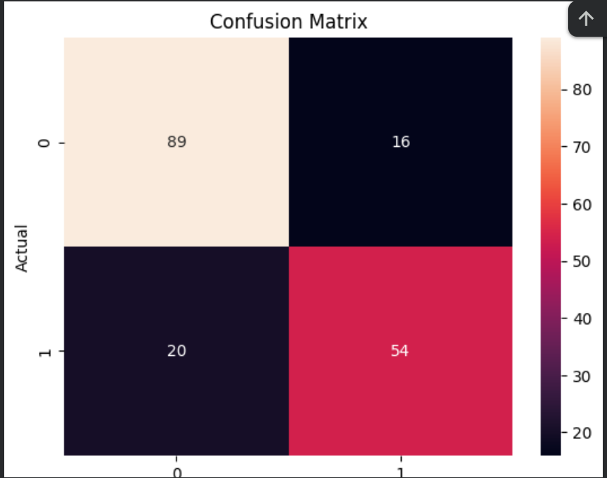

# 🚀 Lead Scoring Model

## 📌 Overview
This project focuses on building a machine learning model to predict which leads are most likely to convert. It helps businesses prioritize high-value customers and improve decision-making.

---

## 🎯 Objective
To classify leads as:
- Likely to Convert (1)
- Not Likely to Convert (0)

---

## 🧩 Dataset
A structured dataset containing customer-related features such as:
- Age
- Gender
- Ticket Class (used as customer category)
- Fare (used as spending behavior)

(Note: Dataset adapted for lead conversion prediction)

---

## ⚙️ Approach

### 1. Data Preprocessing
- Handled missing values
- Selected relevant features
- Converted categorical data into numerical format

### 2. Model Building
- Used **Logistic Regression** for classification
- Split data into training and testing sets

### 3. Evaluation
- Accuracy Score
- Confusion Matrix

---

## 📊 Results
- Model Accuracy: **~80%**
- Successfully classified most of the leads correctly

---

## 📈 Confusion Matrix

## 💼 Business Impact
- Helps businesses identify high-potential customers
- Improves conversion rates
- Saves time and resources for sales teams

---

## 🛠️ Technologies Used
- Python
- Pandas, NumPy
- Scikit-learn
- Matplotlib, Seaborn

---

## 🚀 Future Improvements
- Use advanced models like Random Forest or XGBoost
- Add more features for better prediction
- Deploy as a web application

---

## 👩‍💻 Author
K. Akshaya
